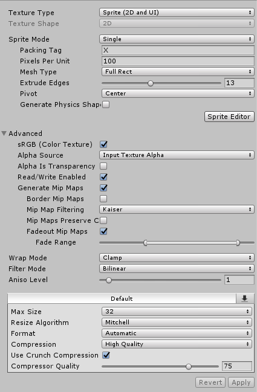

# CustomImportImage

Here's an example code on how to customize image import settings in Unity.

It uses uses AssetPostprocessor, which lets you to hook into the import pipeline and run scripts before or after import is triggered.

I thought to gather every setting visible in UI to this file, so that it's faster to configure a custom importer when needed.

Some of the parameters need to be accessed via settings objects, and those aren't really documented that well (or at all.)

### Important

- I have limited the example code to only process files in folders that contain word "Sprite".

- Editor scripts need to be in an "Editor" folder somewhere under your Assets folder. You can create a subfolder called "Editor" if you got a folder called "Scripts" (for example.) Otherwise Editor scripts will not receive the editor callbacks and they will not run.

- *Always pay attention when altering assets with Editor scripts etc., you might mess up things really bad. Do tests in a dedicated project, verify that things function correctly.*

### Included snippets with valid input parameter examples

- Texture Type
- Texture Shape

- Sprite Mode
- Packing Tag
- Pixels Per Unit
- Mesh Type
- Extrude Edges
- Pivot
- Generate Physics Shape

- Advanced
    - Alpha Source
    - Alpha Is Transparency
    - Read/Write Enabled
    - Generate Mip Maps
    - Border Mip Maps
    - Mip Map Filtering
    - Mip Maps Perserve Coverage
    - Fadeout Mip Maps
        - Fade Range

- Wrap Mode
- Filter Mode
- Aniso Level

- Default
    - Max Size
    - Resize Algorithm
    - Format
    - Compression
    - Use Crunch Compression
    - Compression quality

- Platform specific settings
    - Use name to target specific platform settings
    - Override for PC, Mac & Linux Standalone
    - Max Size
    - Resize Algorithm
    - Format

